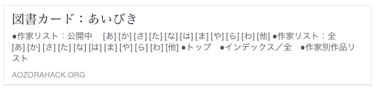
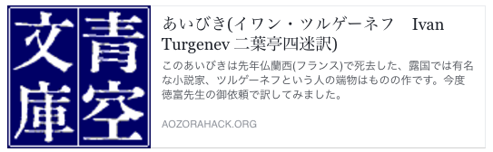

# ogp

※[aozorahack hackathon #1(2016/07/30-31)](http://aozorahack.connpass.com/event/33921/)の成果物です。2018/07/26より、青空文庫本体に取り込まれています!(ref. [#7](https://github.com/aozorahack/ogp/issues/7))

青空文庫の図書カードに[OGP](http://ogp.me/)を設定しました。 これにより、FacebookやTwitterでシェアした時などに表示される情報を改善できます。

OGPやOGPを使ってシェアされたものの例は[Facebookのウェブ管理者向けシェア機能ガイド](https://developers.facebook.com/docs/sharing/webmasters)や[Twitter Cardの説明ページ](https://dev.twitter.com/ja/cards/overview)を参照してください。

## OGPの導入イメージ

図書カード：No.5の[あいびき](http://www.aozora.gr.jp/cards/000005/card5.html)( by [青空文庫](http://www.aozora.gr.jp/guide/kijyunn.html); [CC BY 2.1 JP](http://creativecommons.org/licenses/by/2.1/jp/) )に手を加えてOGPを設定してみました。

添付している画像は、Facebookのシェアボタンを押した時とのスクリーンショットです。 [Open Graph Debugger](https://developers.facebook.com/tools/debug/)(閲覧にはログインが必要)を使って取得しています。オリジナル版以外はTwitterでも同様の表示になります。

作者情報の表記は、[XHTML版](http://www.aozora.gr.jp/cards/000005/files/5_21310.html)のtitleタグの内容を参考にしています。

| スクリーンショット | HTML |
| --- | --- |
|  | [card5.html(オリジナル)](https://aozorahack.github.io/ogp/cards/000005/card5.html) |
|  | [card5_1.html(OGPに、タイトルと作者情報を含めたもの) ](https://aozorahack.github.io/ogp/cards/000005/card5_1.html) |
|  | [card5_2.html(OGPに、タイトルと作者情報と本文の冒頭を含めたもの)](https://aozorahack.github.io/ogp/cards/000005/card5_2.html) |

## OGP用に本文の冒頭を抽出し、OGPを埋め込む方法

### 準備
Rubyを使います。
`aozora2html`が必要です。
```
gem install aozora2html
```

### 実行
以下を実行すると指定した図書カードのHTMLにOGPのためのメタデータを埋め込めます。
```
ruby aozora2unicode.rb --apply-ogp CSV INPUT OUTPUT
```
- `CSV`: `list_person_all_extended_utf8.csv`に相当するファイルかそれを圧縮したzipファイル、またはそのURL
- `INPUT`: 図書カードのHTMLファイル、またはそのURL
- `OUTPUT`: 出力先のファイル名

このとき以下で生成される内容の先頭256文字が図書カードのdescription（FacebookやTwitterで表示される説明文）になります。
```
ruby aozora2unicode.rb INPUT OUTPUT
```
`INPUT`（青空文庫のテキストファイル/それを圧縮したzipファイル/そのzipファイルのURL）からUTF-8のテキストファイルを生成して`OUTPUT`に出力されます。
- アクセント符号→対応するUnicodeに置換
- 外字→対応するUnicodeに置換（あれば）
- ルビ→漢字（かんじ）
- 字下げ等のタグ→削除
- 外部の画像等→`alt`属性のみ

## ライセンス
このレポジトリのライセンスは[CC BY 4.0](https://creativecommons.org/licenses/by/4.0/)です。
